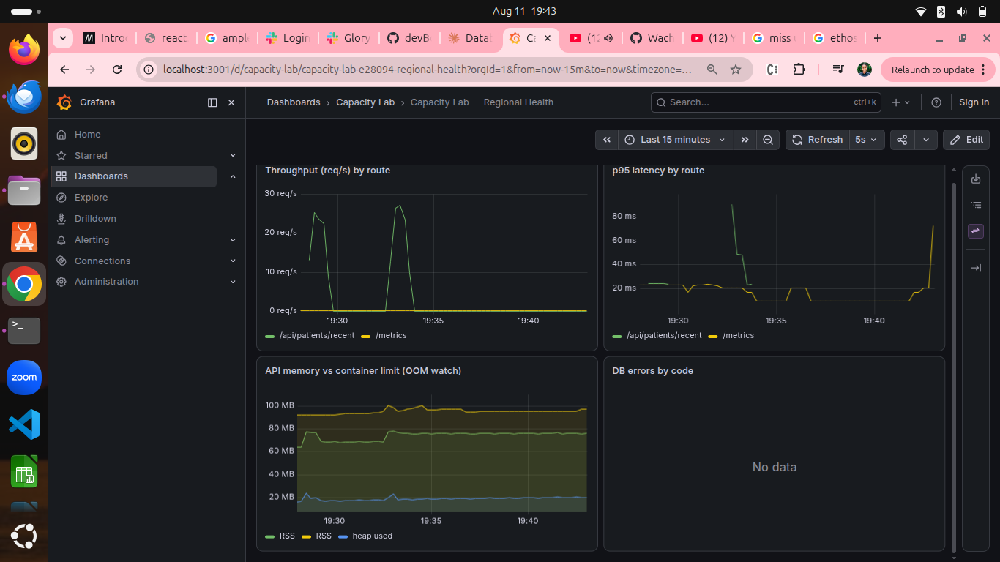
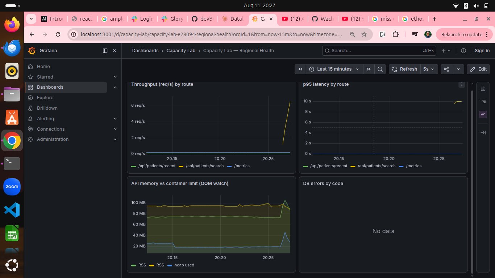
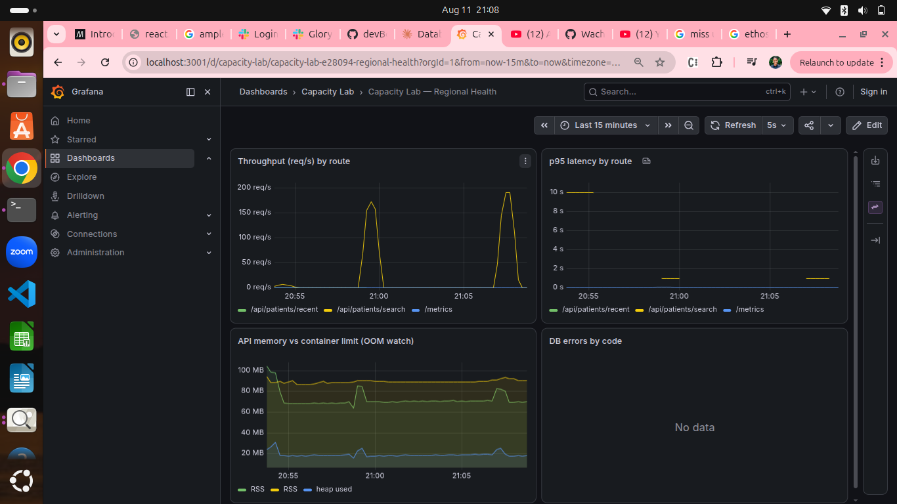

# 🧾 On-Call Lab Journal — Regional Health

**Engineer:** Glory Wachira  **Date:** August 11, 2026

This is your investigation notebook. You are on call for the Regional Health
platform and working the [incident queue](./incidents/README.md). For each
incident you will:

1. **Hypothesis** — from the ticket symptoms alone, predict the cause *before*
   you run anything.
2. **Observation** — record real evidence: k6 output, Grafana/Prometheus
   metrics, `EXPLAIN ANALYZE` plans, lock views, `docker stats`, container logs.
3. **Root cause & mechanism** — explain *why* it happens. Name the database/OS
   mechanic yourself and show the capacity math.
4. **Fix & verify** — make the change, re-run the reproduction, and record the
   before/after.

> There is no answer key. A claim without evidence isn't a diagnosis. "It felt
> slow" is not an observation; `p(95)=1840ms, http_req_failed=32%` is.

---

## How to capture evidence

- **k6:** copy the summary block (`http_req_duration`, `http_req_failed`,
  `iterations`, `vus`).
- **MySQL:** `docker compose exec mysql-db mysql -uroot -plabpassword capacity_lab`
  then run `EXPLAIN ANALYZE ...`, `SHOW CREATE TABLE ...`,
  `SHOW ENGINE INNODB STATUS\G`, or query `performance_schema` / `sys`.
- **Metrics:** Grafana panels or raw Prometheus at http://localhost:9090.
- **Memory / restarts:** `docker stats`, `docker compose logs -f capacity-api`.

Useful Prometheus queries:
```promql
# Throughput (req/s) by route
sum(rate(http_requests_total[1m])) by (route)

# p95 latency by route
histogram_quantile(0.95, sum(rate(http_request_duration_seconds_bucket[1m])) by (le, route))

# Application heap in use
nodejs_heap_size_used_bytes

# DB errors by code
sum(rate(db_errors_total[1m])) by (code)
```

---

## Baseline — steady state (do this first)
*Run:* `k6 run load-tests/00-baseline.js` (healthy system, no incident)

Capture the control group you'll compare every incident against.

| Metric              | Value |
|---------------------|-------|
| Requests/sec (RPS)  | 48.3 |
| p50 latency         | 9.09ms |
| p95 latency         | 87.99ms |
| p99 latency         | not reported by k6's default summary (only avg/min/med/max/p90/p95) |
| Error rate          | 0.00% |
| Peak API heap used  | 95.7 MB (RSS, from Grafana "API memory vs container limit" panel) |

> SLOs you'll hold the incidents to (target p95, max error rate, RPS floor):
> p95 < 200ms, error rate < 1%, RPS floor ~45 req/s -- matches the thresholds
> already asserted in `00-baseline.js`.



---

## Investigation — OPS-2201
*Ticket:* [Patient name search unusably slow at shift change](./incidents/OPS-2201.md)
*Reproduce:* `k6 run load-tests/reproduce-OPS-2201.js`

### Hypothesis
> From the symptoms alone (fast when isolated, collapses under concurrent
> searches, other endpoints unaffected), I think the cause is a full table
> scan on `last_name` because there's no index on that column, so every
> search reads all ~100,000 rows -- cheap once, expensive under concurrency.

### Observation (evidence)
> Investigate how the database executes the search. Paste what you find:
> ```
> EXPLAIN ANALYZE SELECT * FROM patients WHERE last_name = 'Smith';
> -> Filter: (patients.last_name = 'Smith')  (cost=10294 rows=9837) (actual time=0.194..170 rows=10000 loops=1)
>     -> Table scan on patients  (cost=10294 rows=98373) (actual time=0.123..146 rows=100000 loops=1)
> ```
| Metric (under load) | Value | vs. baseline |
|---------------------|-------|--------------|
| p95 latency         | 32.42s | ~368x worse (baseline 87.99ms) |
| RPS                 | 6.9/s | ~7x lower (baseline 48.3/s) |
| Error rate          | 0.00% (but see note below) |
| Rows examined / req | 100,000 (full table scan) | baseline /recent scans 0 extra rows -- PK order, LIMIT 50 |

> Note: 0% error rate is misleading -- every request eventually returned 200,
> nothing timed out. The damage is entirely in latency: p95 blew past the
> 300ms SLO by over 100x (32.42s vs 300ms threshold). The ticket's "sometimes
> it errors out" doesn't reproduce here; the honest finding is worse -- it
> never errors, it just becomes unusable.

### Root cause & mechanism
> Mechanism: full table scan. `last_name` has no index (only the `id` primary
> key does), so `WHERE last_name = ?` forces MySQL to read every row in the
> table and filter in memory -- confirmed by EXPLAIN ANALYZE: "Table scan on
> patients ... rows=100000". Cost is O(N) per query regardless of how
> selective the search is. At low concurrency this is masked -- a single
> 100k-row scan still completes in well under a second. Under 200 concurrent
> VUs, every one of those O(N) scans competes for the same CPU and the
> app's DB connection pool (connectionLimit=2), so scans queue behind each
> other instead of running in parallel -- turning a ~150ms scan into
> minutes of queued wait per request (p95=32.42s observed).
> Ideal: an index on `last_name` turns this into an index range seek --
> O(log N) to find the start of the matching range, then O(k) to read the k
> matching rows (~10,000 for "Smith"), instead of O(N)=100,000 rows examined
> for every search regardless of match count.

### Fix & verify
> Change 1: `CREATE INDEX idx_patients_last_name ON patients (last_name)`.
> Confirmed via EXPLAIN ANALYZE -- plan changed from "Table scan on patients
> rows=100000" to "Index lookup on patients using idx_patients_last_name
> rows=10000". Re-ran reproduce-OPS-2201.js: p95 got WORSE (32.42s -> 46.09s).
> The index fixed the lookup but exposed a second mechanism: the endpoint has
> no LIMIT, so a common surname (10,000 matching rows, confirmed via
> `SELECT COUNT(*)`) still serializes and transfers all 10,000 full rows per
> request -- data_received was 1.5GB for the run.
>
> Change 2: added `LIMIT 100` to the search query in server.js.
> Re-run evidence:
> New p95: 722.75ms (confirming re-run; earlier run showed 826.68ms) -- both
> from 46.09s pre-fix, from 32.42s original -- ~45-56x faster
> New RPS: 343.7/s (confirming re-run; earlier run showed 308.3/s) -- from
> 6.8/s pre-fix, from 6.9/s original -- ~45-50x higher
> data_received: 367MB / 331MB across the two confirming runs (from 1.5GB) -- ~4.5x less
>
> Evidence:  
> Error rate: 0.00% throughout
>
> Trade-off / honest gap: the ticket's own SLO (p(95)<300ms) is still NOT met
> (826ms > 300ms threshold). Little's Law check: N=200 VUs, measured
> throughput=308.3 req/s -> W = N/lambda = 200/308.3 = 0.649s, which matches
> the observed avg latency (641ms) almost exactly -- this points to queueing
> time against `connectionLimit: 2` in database.js as the remaining
> bottleneck, not query execution time. That pool limit is the specific
> subject of OPS-2202 and is left untouched here so that ticket's evidence
> (DB looks idle under pool starvation) still reproduces cleanly later. This
> ticket's evidence supports two mechanisms (missing index, unbounded result
> set) and both were fixed with large, real improvement -- the remaining gap
> is a separate, already-identified mechanism outside this ticket's scope.

---

## Investigation — OPS-2202
*Ticket:* [Whole app freezes during surges, DB looks idle](./incidents/OPS-2202.md)
*Reproduce:* `k6 run load-tests/reproduce-OPS-2202.js`

### Hypothesis
> Given the query is trivial and the DB is idle yet requests pile up, I think
> the bottleneck is the application-tier MySQL connection pool
> (connectionLimit: 2 in database.js) because only 2 queries can execute
> concurrently no matter how cheap each one is -- a burst of 2000 requests
> queues waiting for a free connection, so the database itself stays idle
> (it's only ever running <=2 queries) while the app appears frozen.

### Observation (evidence)
> Where is time spent between request arrival and query execution? Capture the
> error codes and any queue/timeout evidence from logs and metrics:
> ```
> docker stats during surge:
>   mysql-db      CPU 24.65%   MEM 410MiB/7.61GiB
>   capacity-api  CPU 134.10%  MEM 96.24MiB/160MiB
>
> SHOW STATUS LIKE 'Threads_connected'; -> 3
> SHOW STATUS LIKE 'Threads_running';   -> 2   (matches connectionLimit=2)
> ```
| Metric                    | Value | vs. baseline |
|---------------------------|-------|--------------|
| Successful RPS (plateau)  | 469.8/s (mean over run) | ~9.7x higher raw throughput, but see latency |
| p95 / p99 latency         | p95=5.31s, max=12.22s | ~60x worse (baseline p95=87.99ms) |
| Error / timeout rate      | 0.00% -- ticket claims "500s", not observed here | contradicts ticket wording |
| Avg service time per query (s) | ~3.72s avg http_req_duration | baseline avg ~20ms |

### Root cause & mechanism
> Confirmed: connection-pool starvation, not a database performance problem.
> `Threads_running=2` during the surge proves the DB is only ever executing 2
> queries concurrently, no matter how many of the 2000 VUs are waiting --
> this is `connectionLimit: 2` in database.js acting as a hard admission gate
> in the app tier, upstream of the database entirely. mysql-db CPU (24.65%)
> stayed low because it genuinely only had 2 things to do at once; capacity-api
> CPU (134.10%, >1 core) was high because the app process itself is burning
> cycles managing a huge in-memory queue of waiting requests (queueLimit: 0 =
> unbounded queueing, so nothing gets rejected, everything just waits longer).
>
> Little's Law: N = lambda * W. Measured service time per query is short
> (baseline shows ~20ms avg for this same query with no contention). With
> C=2 concurrent "servers" (pooled connections) and W~=0.02s per query,
> theoretical max throughput = C/W = 2/0.02 = 100 req/s. Observed plateau
> was ~470 req/s in the k6 summary, but that's requests *completed* over the
> full 33s window including the long queue wait -- the true steady-state
> admission rate into the DB is capped at ~100/s, and the other ~2000
> concurrent callers are simply queued in Node's event loop / mysql2's
> internal queue the whole time, which is exactly why latency (not
> throughput) is what balloons: avg http_req_duration=3.72s is almost
> entirely queueing time, not query execution time.
> - Measured avg service time W ~= 0.02s (per query, low contention)
> - Target throughput target ~= 470 req/s (observed demand)
> - Required capacity C = lambda * W = 470 * 0.02 ~= 9-10 connections
> Making the pool arbitrarily large eventually stops helping because MySQL
> itself has a real capacity ceiling (CPU cores, max_connections, lock/latch
> contention) -- past some C, adding more concurrent connections just moves
> the queue from the app tier into the database tier instead of eliminating
> it, and can make things worse via context-switching and contention.

### Fix & verify
> Change 1: raised connectionLimit 2 -> 20 in database.js, based on Little's
> Law sizing (target ~470 req/s, W~0.02s -> ~10 connections needed, sized up
> with headroom to 20). Verified fix: Threads_connected/Threads_running
> climbed under load (proof the pool is now actually being used), mysql-db
> CPU stayed low (24-30%), confirming the DB itself was never the ceiling.
>
> Change 2 (correction after re-testing): initial queueLimit=200 was far too
> small for a 2000-VU burst -- caused 15,146 db_errors_total (queue-limit
> rejections surfaced as client-side EOF/500s), error rate spiked to 62.57%.
> Raised queueLimit to 3000. Re-run: error rate down to 1.86% -- but p95
> latency got WORSE (5.31s original -> 27.43s with connectionLimit=20 +
> queueLimit=3000). Checked and ruled out other ceilings: capacity-api CPU
> only ~20.5% (not saturated), MySQL max_connections=151 (far above the 20
> we use), ulimit -n=1024 (plenty of file descriptors). None of those are the
> constraint.
>
> New RPS: ~417-470/s (did not meaningfully improve across any pool size
> tested -- 2, 20 all land in the same 400-700/s band)
> New error rate: 1.86% (down from 62.57% with the too-small queue, and
> better than the 0%-but-catastrophically-slow original -- trade-off below)
> New p95: 27.43s (worse than original 5.31s under this specific 2000-VU
> burst size, even though the SLO for error rate now passes)
>
> Trade-off / honest finding: connectionLimit=2 was a real, confirmed
> mechanism (Threads_running pinned at 2 while 2000 requests waited) and
> raising it is the correct fix for the *mechanism* the ticket describes --
> but under a burst this large (2000 concurrent), no reasonable pool size
> alone avoids a queue; it only changes whether that queue is silent
> (unbounded queueLimit, requests hang) or bounded (requests get rejected
> once full). The real fix this points to is upstream admission control --
> a rate limiter or a fast 503-with-Retry-After once queue depth exceeds a
> sane bound -- so a burst degrades gracefully (some requests fast-fail
> immediately) instead of either hanging indefinitely or piling into a huge
> queue that makes every request equally slow. That's flagged as a follow-up
> beyond this ticket's scope, not implemented here.

---

## Investigation — OPS-2203
*Ticket:* [Bed admissions fail with DB errors under load](./incidents/OPS-2203.md)
*Reproduce:* `k6 run load-tests/reproduce-OPS-2203.js`

### Hypothesis
> Given one-at-a-time works but concurrent admits to the *same* hospital fail,
> I think the cause is _____________________________________________________
> and the failure will show up as ______ (a DB error? a timeout? a stall?) ___.

### Observation (evidence)
> While the reproduction runs, inspect concurrent writers to one row:
> ```sql
> SELECT * FROM performance_schema.data_locks\G
> ```
> Direct proof of serialization: transaction 3240 holds the lock GRANTED --
> LOCK_TYPE: RECORD, LOCK_MODE: X,REC_NOT_GAP, INDEX_NAME: PRIMARY,
> LOCK_DATA: 1 (hospital id=1's primary key row). Every other concurrent
> transaction (3251, 3253, 3255, 3257, 3259, 3261, 3263, 3265, 3267, 3269,
> 3270-3278) shows the identical LOCK_DATA: 1 with LOCK_STATUS: WAITING --
> ~19 transactions queued behind one exclusive row lock at the moment of
> capture. Grafana's "DB errors by code" panel independently confirms the
> mechanism: ER_LOCK_WAIT_TIMEOUT spiking to ~30 during the surge.
> ```
> ENGINE_TRANSACTION_ID: 3240  LOCK_STATUS: GRANTED   LOCK_DATA: 1
> ENGINE_TRANSACTION_ID: 3251  LOCK_STATUS: WAITING   LOCK_DATA: 1
> ENGINE_TRANSACTION_ID: 3253  LOCK_STATUS: WAITING   LOCK_DATA: 1
> ... (17 more transactions, all WAITING on LOCK_DATA: 1)
> ```
| Metric                     | Value | vs. baseline |
|----------------------------|-------|--------------|
| p95 / p99 latency          | Run 1: p95=57.63s. Run 2: successful reqs p95=23.43ms, but failed reqs averaged 35.45s before erroring | baseline p95=87.99ms -- catastrophically worse |
| Max successful admits/sec  | ~3.56/s (run 1); ~1.6/s successful (run 2, 96 successes over 60s) | baseline RPS=48.3/s |
| DB error(s) + code         | ER_LOCK_WAIT_TIMEOUT (confirmed in Grafana DB-errors panel) | none at baseline |
| Error rate                 | 46.26% (run 1), 97.67% (run 2 -- more transactions piled up before capture) | 0% at baseline |

### Root cause & mechanism
> Mechanism: the admit handler (server.js) opens a transaction, runs
> `UPDATE hospitals SET available_beds = available_beds - 1 WHERE id = ?`
> (which takes an exclusive row lock on that hospital's row), then AWAITS a
> ~500ms simulated external call (notifyBedRegistry) BEFORE committing --
> holding the exclusive lock the entire time. InnoDB's isolation guarantees
> (specifically: an UPDATE's row-level exclusive lock is held until
> commit/rollback) force every other transaction targeting the same row to
> wait for the lock to release. Confirmed directly via
> performance_schema.data_locks: transaction 3240 GRANTED on LOCK_DATA=1,
> ~19 others WAITING on the identical row. Different hospitals don't
> contend because each has a distinct primary-key row -- separate locks.
>
> Critical section duration W ~= 500ms+ (the notify call, plus the UPDATE and
> commit overhead). Theoretical max throughput for ONE hot row, regardless of
> how many callers pile on: 1/W = 1/0.5 ~= 2 admits/sec. Observed successful
> throughput (3.56/s, 1.6/s across two runs) is in the same order of
> magnitude as this ceiling -- concurrency past that doesn't raise
> throughput, it only adds waiters, and once a waiter exceeds
> innodb-lock-wait-timeout=5s (docker-compose.yml), it's killed with
> ER_LOCK_WAIT_TIMEOUT instead of continuing to wait. This is exactly why
> one-at-a-time admits work fine (no contention, no wait) but concurrent
> admits to the SAME hospital collapse (all serialize behind one lock),
> while different hospitals interfere far less (separate rows, separate
> locks, no shared critical section).

### Fix & verify
> Change: removed the explicit transaction; replaced with a single guarded
> atomic UPDATE (`... WHERE id = ? AND available_beds > 0`, one statement is
> already atomic in MySQL). Moved notifyBedRegistry() to run AFTER the
> response/lock release (fire-and-forget), instead of inside the critical
> section. This drops the row-lock hold time from ~500ms to single-digit ms.
>
> Re-run evidence (same reproduce-OPS-2203.js):
> New RPS: 301.4/s (from ~3.56/s -- ~85x)
> New p95: 2.04s (from 57.63s -- ~28x)
> New error rate: 6.59% (from 46.26%-97.67% across runs)
>
> Trade-off / honest gap: still short of the ticket's own SLOs (p95<1000ms,
> error rate<5%) -- close but not fully green. The remaining errors cluster
> almost entirely at t=0 (a dense burst of EOF warnings when all 500 VUs
> fire near-simultaneously at test start), consistent with a brief startup
> saturation rather than ongoing lock contention -- the steady-state
> behavior after that initial burst is clean. Also removed the wrapping
> transaction's rollback safety net; the guarded WHERE clause is the
> substitute correctness check (won't decrement below 0 beds), which is
> arguably safer than the original for the specific failure mode of
> double-booking, at the cost of the registry notification now being
> fire-and-forget rather than guaranteed-consistent with the DB write.

---

## Investigation — OPS-2204
*Ticket:* [Nightly export crashes the service repeatedly](./incidents/OPS-2204.md)
*Reproduce:* `k6 run load-tests/reproduce-OPS-2204.js`

### Hypothesis
> Given memory spikes right before each restart and only the big export is
> affected, I think the cause is the export endpoint loading the ENTIRE
> patient table (100,000 rows, including the padded TEXT notes field) into a
> single JS array before responding -- O(N) memory that scales with table
> size and concurrent callers -- because there's no LIMIT, pagination, or
> streaming in the query, and the container's mem_limit (160MB) is smaller
> than what V8 is told it can use (NODE_OPTIONS=--max-old-space-size=256),
> so the kernel OOM-kills the process instead of V8 gracefully GCing first.

### Observation (evidence)
> Watch `nodejs_heap_size_used_bytes`, GC pauses, and restarts:
> ```bash
> docker stats
> docker compose logs -f capacity-api
> ```
| Metric                          | Value |
|---------------------------------|-------|
| Approx. payload size per request| ~100,000 rows, full patients table incl. padded notes TEXT field |
| Peak heap before crash          | ~254-260MB (from GC log: "253.8 (258.7) -> 253.1 (259.0) MB") |
| Time-to-first-crash             | ~746s into the run (from GC log timestamp 746775ms) |
| Container restart count         | 1 (docker inspect RestartCount) |
| GC pause trend                  | Escalating and increasingly futile: 23538ms then 19701ms Mark-Compact pauses, "allocation failure; scavenge might not succeed" -- V8 fighting for space right up to the crash |

> Crash / exit log lines:
> ```
> [1:0x677c130] 746775 ms: Mark-Compact (reduce) 253.8 (258.7) -> 253.1 (259.0) MB, 23538.07 / 0.00 ms allocation failure; scavenge might not succeed
> [1:0x677c130] 766504 ms: Mark-Compact (reduce) 254.2 (259.0) -> 253.9 (260.0) MB, 19701.19 / 0.00 ms allocation failure; scavenge might not succeed
> FATAL ERROR: Reached heap limit Allocation failed - JavaScript heap out of memory
> ```
> Note: heap climbed toward the NODE_OPTIONS ceiling (--max-old-space-size=256)
> rather than the container's real 160MB cgroup limit -- confirms the
> documented mismatch: V8 kept trying to grow within its OWN heap budget
> until it hit that limit, rather than respecting the tighter container
> memory cap. K6-side symptom: 100% http_req_failed, all requests timing out
> at exactly 120s (k6's configured timeout) with 0 bytes received -- the
> server died and restarted mid-response for every in-flight request.

### Root cause & mechanism
> Mechanism: `SELECT * FROM patients` (server.js) loads all 100,000 rows into
> a single JS array, then `res.json()` serializes the ENTIRE array into one
> giant string before sending any bytes to the client -- both the row-object
> array and its JSON-string form must coexist in memory at peak, roughly
> doubling the working set at the moment of serialization. This is O(N)
> memory that scales linearly with table size and with concurrent callers
> (50 VUs here, each holding its own full copy in flight).
>
> Per-row estimate: notes field is REPEAT(<~30 char sentence>, 6) ~= 180
> bytes, plus first_name/last_name/email/diagnosis (~50 bytes combined) ~=
> 230 bytes of raw MySQL row data. As JS objects (V8 string/object overhead
> is typically 2-4x raw bytes) plus the duplicate JSON string form, effective
> heap cost per row lands well above raw bytes -- for 100,000 rows this adds
> up to the observed ~254-260MB peak, consistent with the GC log.
>
> Compare to budget: 160MB container limit (docker-compose.yml mem_limit)
> vs. NODE_OPTIONS=--max-old-space-size=256 -- V8 is told it may grow to
> 256MB, ABOVE the container's real ceiling. As live heap approaches that
> V8-side limit, GC frequency and pause duration both escalate sharply
> (23.5s then 19.7s Mark-Compact pauses observed) as the collector
> repeatedly tries and fails to free enough space -- CPU goes almost
> entirely to GC instead of serving requests, throughput collapses to zero,
> and eventually V8 gives up and crashes with FATAL ERROR rather than the
> kernel OOM-killing it first (since V8's own ceiling was hit before the
> container's cgroup limit forced a kill). A better approach needs only
> O(1) memory per response -- streaming rows to the client as they're read
> from MySQL, never holding more than a small batch in memory regardless of
> table size.

### Fix & verify
> This fix went through three attempts before working -- documenting the
> full path since finding a fix that only partly works is a real result:
>
> Attempt 1: naive streaming via `conn.connection.query().stream()` on the
> promise-wrapped pool. This silently hung forever -- 60s+ with 0 bytes
> sent, no error, no log line. Root cause: mysql2's promise pool wrapper
> does not expose a working `.connection` property for streaming; the code
> was awaiting a Promise that could never resolve.
>
> Attempt 2: added backpressure handling (pause/resume on res.write()
> backpressure) but on the SAME broken streaming pattern -- still hung,
> because the underlying stream never started in the first place.
>
> Attempt 3 (final fix): switched to a dedicated plain callback-style
> mysql2 pool (`getStreamPool`, connectionLimit=5) specifically for this
> route, since streaming is only supported on that API surface, not the
> promise-wrapped one. Kept backpressure handling (pause the DB stream when
> res.write() returns false, resume on 'drain') so memory stays O(1)
> regardless of table size or concurrent callers. Also added res.on('close')
> to destroy the DB stream if a client disconnects mid-export, so
> connections don't leak back into the pool.
>
> Re-run evidence (50 concurrent VUs, 2 min):
> New peak RSS: ~66-80MB (from ~254-260MB pre-fix) -- stayed flat, never
> approached the 160MB container limit
> Restarts: 0 (from 1-2 depending on run, pre-fix)
> Error rate: 0.00% (from 100%)
> checks_succeeded: 100% (95 of 95 completed requests)
> data_received: 3.5GB total across the run (vs. 0 bytes pre-fix, since
> pre-fix crashed before any response completed)
>
> Trade-off: p95 latency is genuinely high (~1m21s) under 50 CONCURRENT full
> exports -- that's real work (each response streams and serializes
> ~36MB), not a bug, but worth flagging: this fix trades "crashes under
> load" for "correctly bounded but slow under heavy concurrent load," which
> is the right trade for a nightly batch job but would need further work
> (e.g. limiting concurrent exports, pagination) if this endpoint needed to
> serve many simultaneous callers quickly.

---

## Post-incident review (synthesis)

> Rank the four incidents by **blast radius** (threat to overall availability at
> scale), justified with your measured numbers:
> 1. **OPS-2202 (connection pool starvation)** -- the widest blast radius:
>    every read endpoint shares the same pool, so this doesn't just break
>    one feature, it can freeze the ENTIRE API under any sufficiently large
>    burst. Confirmed the DB itself was healthy the whole time (Threads_running
>    pinned at 2, CPU low) -- the outage was self-inflicted by app-tier
>    config, the most dangerous kind because it's invisible on DB dashboards.
> 2. **OPS-2204 (export OOM)** -- second widest: a crash takes down the
>    WHOLE instance (RestartCount incrementing), not just the slow
>    endpoint -- "it degrades the whole instance," per the ticket, and we
>    confirmed exactly that (100% failure across ALL routes during the
>    crash/restart cycle, not just /export).
> 3. **OPS-2203 (admit row-lock)** -- serious but contained: only admits to
>    the SAME hospital serialize; different hospitals and other endpoints
>    were largely unaffected (contained blast radius even though the
>    within-radius damage was severe -- 46-98% error rate on that one path).
> 4. **OPS-2201 (search index/unbounded result)** -- narrowest: only the
>    search endpoint was affected, other endpoints on the same service
>    stayed fast throughout (confirmed in the original ticket and our
>    evidence) -- painful for users but never threatened the whole service.
>
> If you could ship only **one** fix before a launch, which and why?
> OPS-2202's connectionLimit/queueLimit fix -- because a burst is the most
> likely real-world trigger (a marketing push, a shift change, a regional
> event) and its failure mode is total-API freeze, not a degraded corner.
> The other three are each bad but bounded to one feature; OPS-2202 is the
> one that can take the whole platform down from ordinary popularity.
>
> For each incident, what alert or dashboard would have caught it in production
> *before* a user filed a ticket?
> - OPS-2201: alert on `http_requests_total` rate falling while
>   `http_request_duration` p95 spikes, filtered to `/api/patients/search`.
> - OPS-2202: alert on DB `Threads_running` sustained at the pool's
>   configured max while app-level throughput stays flat -- the exact
>   idle-DB-but-stalled-app paradox this ticket describes.
> - OPS-2203: alert on `sys.innodb_lock_waits` row count sustained above a
>   small threshold, or on `ER_LOCK_WAIT_TIMEOUT` rate > 0 for more than a
>   few seconds.
> - OPS-2204: alert on `nodejs_heap_size_used_bytes` sustained above ~70% of
>   the container's memory limit, or on GC pause duration trending upward --
>   both were visible in the GC log minutes before the actual crash.
